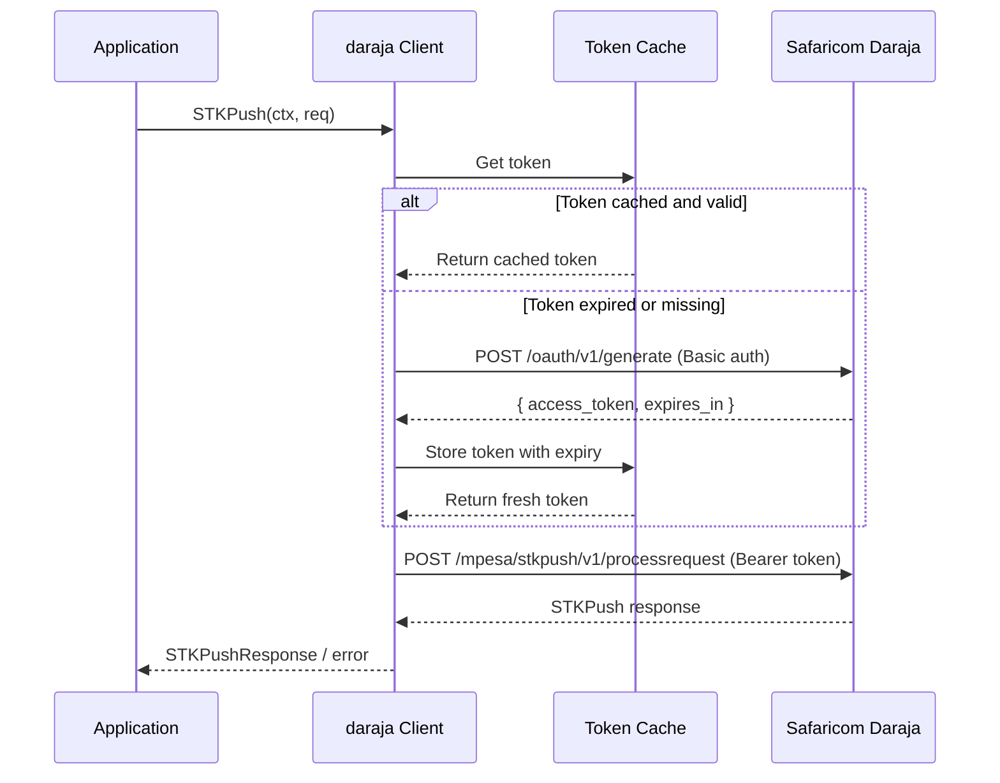
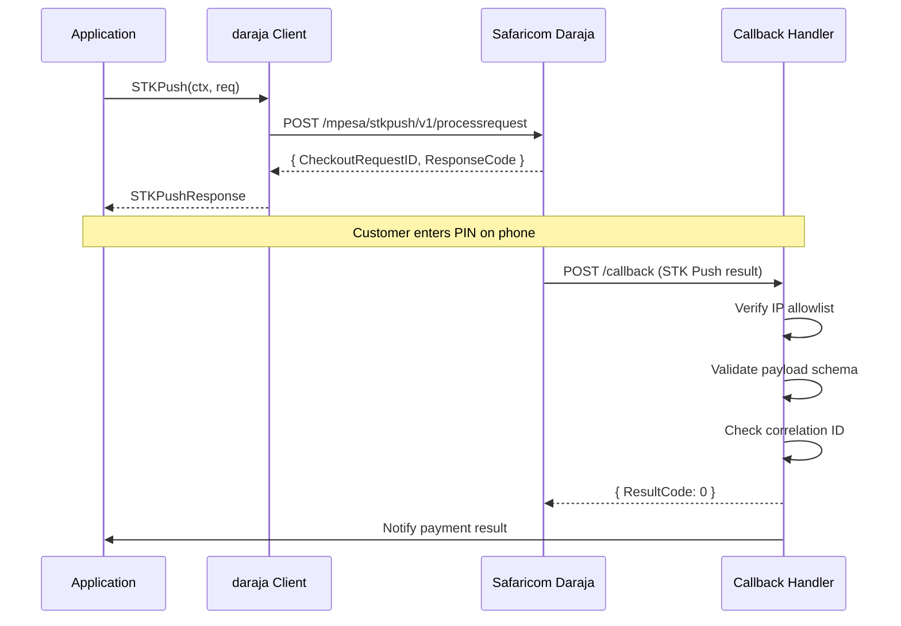
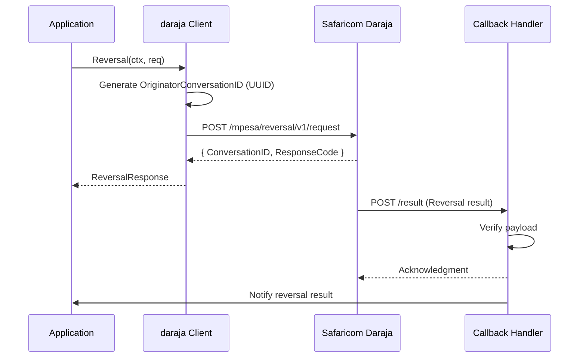

## OAuth Token Lifecycle

```mermaid
sequenceDiagram
    participant App as Application
    participant Client as daraja Client
    participant Cache as Token Cache
    participant Daraja as Safaricom Daraja

    App->>Client: STKPush(ctx, req)
    Client->>Cache: Get token
    alt Token cached and valid
        Cache-->>Client: Return cached token
    else Token expired or missing
        Client->>Daraja: POST /oauth/v1/generate (Basic auth)
        Daraja-->>Client: { access_token, expires_in }
        Client->>Cache: Store token with expiry
        Cache-->>Client: Return fresh token
    end
    Client->>Daraja: POST /mpesa/stkpush/v1/processrequest (Bearer token)
    Daraja-->>Client: STKPush response
    Client-->>App: STKPushResponse / error
```

## STK Push Request/Callback Lifecycle

```mermaid
sequenceDiagram
    participant App as Application
    participant Client as daraja Client
    participant Daraja as Safaricom Daraja
    participant CB as Callback Handler

    App->>Client: STKPush(ctx, req)
    Client->>Daraja: POST /mpesa/stkpush/v1/processrequest
    Daraja-->>Client: { CheckoutRequestID, ResponseCode }
    Client-->>App: STKPushResponse

    Note over App,CB: Customer enters PIN on phone

    Daraja->>CB: POST /callback (STK Push result)
    CB->>CB: Verify IP allowlist
    CB->>CB: Validate payload schema
    CB->>CB: Check correlation ID
    CB-->>Daraja: { ResultCode: 0 }
    CB->>App: Notify payment result
```

## Reversal Workflow

```mermaid
sequenceDiagram
    participant App as Application
    participant Client as daraja Client
    participant Daraja as Safaricom Daraja
    participant CB as Callback Handler

    App->>Client: Reversal(ctx, req)
    Client->>Client: Generate OriginatorConversationID (UUID)
    Client->>Daraja: POST /mpesa/reversal/v1/request
    Daraja-->>Client: { ConversationID, ResponseCode }
    Client-->>App: ReversalResponse

    Daraja->>CB: POST /result (Reversal result)
    CB->>CB: Verify payload
    CB-->>Daraja: Acknowledgment
    CB->>App: Notify reversal result
```